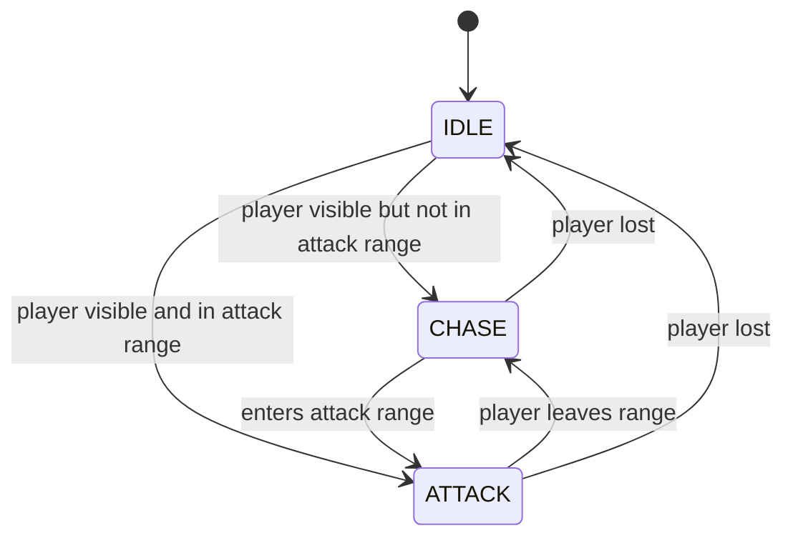
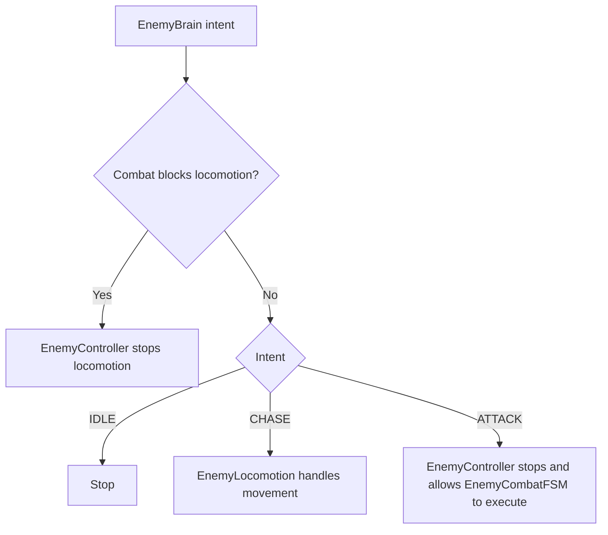

# AI Architecture

## Overview
Enemy AI is intentionally split into five layers:

1. `EnemyPerception`
2. `EnemyBrain`
3. `EnemyController`
4. `CombatDirector`
5. `EnemyLocomotion` / `EnemyCombatFSM`

This keeps sensing, decision-making, orchestration, and execution separate.

## Intent Flow

```text
Perception
  ↓
Brain
  ↓
Controller
  ↓
Locomotion / CombatFSM
```

## Responsibilities

### `EnemyPerception`
Responsibilities:
- measure player distance
- determine attack-range eligibility
- determine line-of-sight visibility
- maintain engagement / disengagement hysteresis for combat-group membership

Outputs:
- `CanSeePlayer`
- `DistToPlayer`
- `IsInAttackRange`
- `IsInEngagementRange`

### `EnemyBrain`
Responsibilities:
- convert perception into coarse intent
- evaluate only at a configurable interval

Owned state:
- `CurrentIntent`

Intent values:
- `IDLE`
- `CHASE`
- `ATTACK`

### `EnemyController`
Responsibilities:
- decide whether locomotion or combat currently owns execution
- route brain intent into movement or stop behavior
- check shared attack permission through `CombatDirector`
- register and unregister the enemy with the combat group
- request controlled slot-basis refresh while engaged
- suppress locomotion when combat has control

### `CombatDirector`
Responsibilities:
- coordinate shared attack permission across multiple enemies
- track registered enemies
- limit how many enemies may actively attack at once
- assign and retain circling-slot angles per enemy
- convert assigned slot angles into world positions around the player
- refresh slot basis only on guarded timing / yaw conditions

### `EnemyLocomotion`
Responsibilities:
- pathfind using `NavMeshAgent`
- move using `CharacterController`
- face movement direction

### `EnemyCombatFSM`
Responsibilities:
- own attack commitment
- own attack windup and attack execution
- own hit reaction execution
- own the enemy-side stun response to a successful player parry
- expose whether combat currently blocks locomotion

## Why Brain Never Executes Movement
- The brain should decide *what the enemy wants*, not *how the body moves*.
- Keeping movement outside the brain prevents decision code from becoming animation/pathfinding code.
- This separation makes future AI upgrades easier.

## Why Controller Exists
- Without a controller, both locomotion and combat would need to understand AI intent and arbitrate ownership directly.
- `EnemyController` acts as the mediator that decides who owns the enemy body on a given frame.
- This prevents locomotion from competing with attack windup or attack recovery.

## Why CombatFSM Owns Execution
- Attack windup, attack motion, and hit reactions are animation-timed and stateful.
- These are execution concerns, not high-level AI concerns.
- CombatFSM is the right place to own action commitment, cooldown timing, and reaction interruption.

## How Locomotion Integrates with AI
- `EnemyBrain` decides whether enemy should chase or attack.
- `EnemyController` routes chase into `EnemyLocomotion`.
- If `EnemyCombatFSM.BlocksLocomotion` is true, controller stops locomotion.
- This creates explicit handoff from navigation to combat execution.

## Execution Order

1. `EnemyPerception.Update`
2. `EnemyBrain.Update`
3. `EnemyController.Update`
4. `EnemyLocomotion` and/or `EnemyCombatFSM.Update`

In practice, the system assumes:
- perception updates continuously
- brain intent updates at a lower frequency
- controller reads the latest intent
- combat can temporarily override locomotion

## AI State Diagram



## Combat Ownership Diagram



## Communication Rules
- `EnemyPerception` should not directly move or attack.
- `EnemyBrain` should not directly move or attack.
- `EnemyController` should not contain attack timing rules.
- `EnemyCombatFSM` should not make high-level perception decisions.

## Current Architecture Notes
- Current AI is simple and deterministic by design.
- `EnemyCombatFSM` now also acts as the entry point for parry-induced enemy stun, while `EnemyController` remains unaware of that low-level combat reaction.
- `CombatDirector` now does first-pass single-attacker coordination plus slot ownership for circling enemies; slot refresh is intentionally throttled to avoid reshuffling every attack.
- The system is prepared for richer `EnemyBrain` logic later, such as utility AI, attack selection policies, and stronger coordination rules.
- The existing split is the correct foundation for those upgrades.
