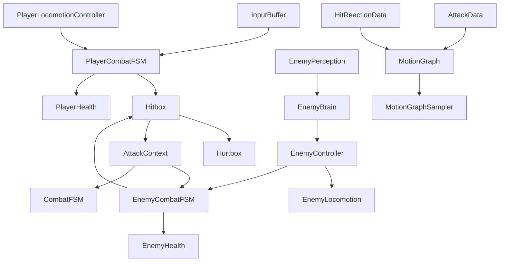
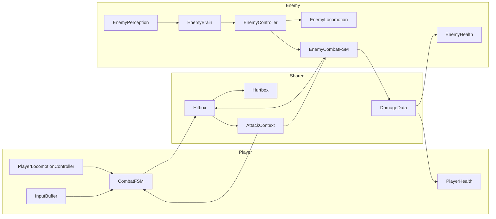
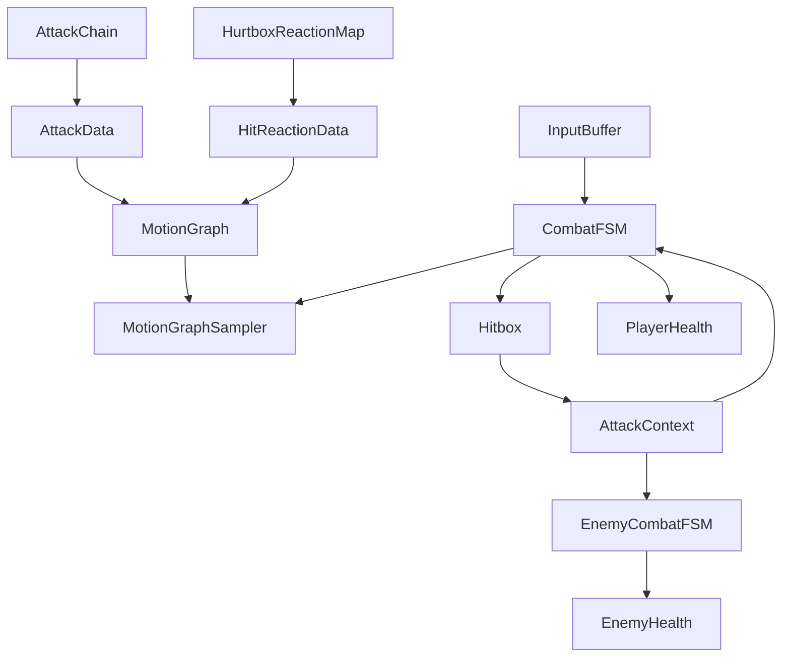
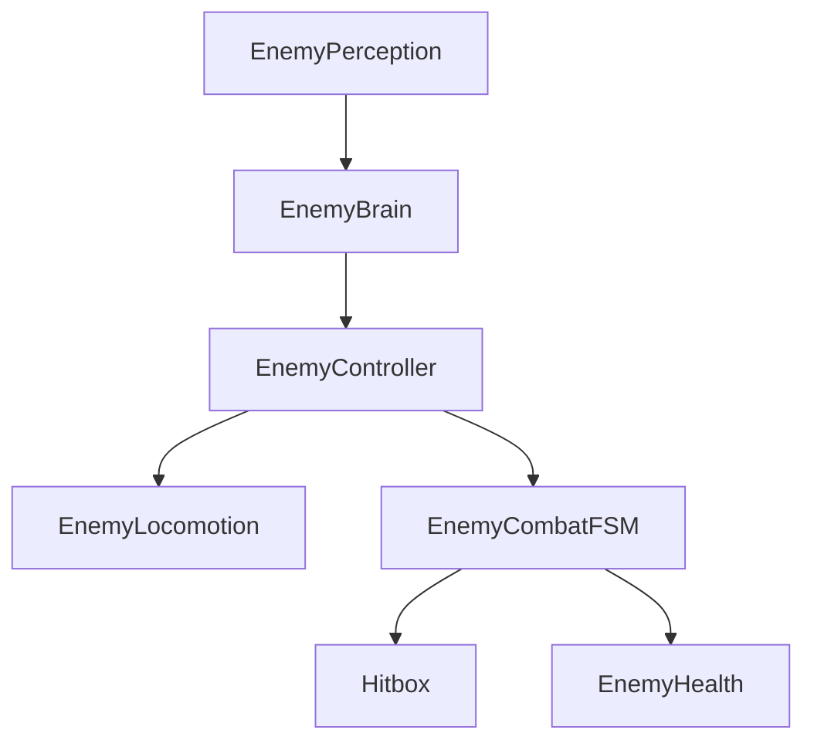

# Architecture

## Overview
This project is a third-person melee combat prototype built in Unity. The codebase is organized around small MonoBehaviour components with clear runtime responsibilities:

- `Player` systems own input buffering, locomotion, combat state, and player health.
- `Enemy` systems split perception, decision-making, orchestration, locomotion, combat execution, and health.
- `ScriptableObject` assets drive attack timing, motion, dodge behavior, parry timing, and hit reactions.
- `Shared` combat primitives (`Hitbox`, `Hurtbox`, `DamageData`, `AttackContext`) connect attacker and defender systems.
- `Terrain` utilities are separate from combat and support stylized terrain and grass rendering workflows.

The architecture is intentionally data-driven for animation-bound gameplay and intentionally componentized for iteration inside the Unity editor.

## Design Philosophy

### Component Philosophy
- Keep decision-making, movement, and combat execution separate.
- Prefer explicit ownership over god objects.
- Use MonoBehaviours as runtime state owners and ScriptableObjects as tuning/configuration assets.

### State Machine Philosophy
- Each actor owns its own combat execution state.
- AI intent and combat execution are separate layers.
- States are animation-aware and time-driven.
- Transitions should reset local state cleanly and avoid hidden side effects.

### Data-Driven Philosophy
- `AttackData`, `AttackChain`, `MotionGraph`, `ParryData`, `DodgeData`, and `HitReactionData` externalize timing and motion tuning.
- Motion is sampled from curves instead of hardcoded translation values.
- Combat behavior is authored by combining runtime FSMs with configurable assets.

## Folder Structure

| Path | Purpose |
| --- | --- |
| `Assets/_Project/Scripts/Player` | Player locomotion, input buffering, combat FSM, player health |
| `Assets/_Project/Scripts/Enemy` | Enemy AI, combat, locomotion, perception, health |
| `Assets/_Project/Scripts/Scriptables` | Combat tuning assets and motion definitions |
| `Assets/_Project/Scripts/Classes` | Lightweight pure runtime helpers such as `MotionGraphSampler` |
| `Assets/_Project/Scripts/Shared` | Shared enums, hitbox/hurtbox primitives, common combat types |
| `Assets/_Project/Scripts/Structs` | Serializable payloads exchanged between systems |
| `Assets/_Project/Scripts/Interfaces` | Shared contracts (`IDamageable`, `IAttackReciever`) |
| `Assets/_Project/Scripts/Terrain` | Terrain and grass generation / interaction utilities |
| `Docs` | Living engineering documentation for the project |

## Major Gameplay Systems

### Player Stack
- `InputBuffer`: records recent combat inputs so attacks, parries, and dodges can consume buffered intent.
- `PlayerLocomotionController`: owns character movement, combat-vs-noncombat movement behavior, and animation speed driving.
- `CombatFSM`: owns player combat execution, attack chaining, dodge/parry states, stunned state, hit reaction selection, and attack hitbox setup.
- `PlayerHealth`: owns player HP and death detection.

### Enemy Stack
- `EnemyPerception`: senses player visibility and attack range.
- `EnemyBrain`: converts perception into a coarse intent (`IDLE`, `CHASE`, `ATTACK`).
- `CombatDirector`: scene-level coordinator that currently limits concurrent enemy attackers.
- `EnemyController`: bridges AI intent into locomotion or combat ownership.
- `EnemyLocomotion`: executes movement using `NavMeshAgent` plus `CharacterController`.
- `EnemyCombatFSM`: owns attack windup, attack execution, stun reactions, parry-stun entry, hitbox setup, and locomotion lock state.
- `EnemyHealth`: owns enemy HP with separate max/current values and local death detection.

### Shared Combat Stack
- `Hitbox`: active attack collider that emits `AttackContext`.
- `Hurtbox`: receiver-side collision marker with body-region metadata.
- `AttackContext`: attacker-to-defender payload containing attack asset, direction, origin, and hit region.
- `DamageData`: defender-side damage payload.
- `HurtboxReactionMap`: maps hurtbox type + direction to a specific `HitReactionData`.
- `HitReactionData`: now defines both total reaction duration and a separate movement-force window used during stunned displacement.

### Motion System
- `MotionGraph`: ScriptableObject containing cumulative displacement and yaw curves.
- `MotionGraphSampler`: samples graph deltas over normalized time and converts cumulative curves into frame deltas.

### Terrain / Rendering Utilities
- `GrassInteractionManager`: updates shader globals for moving interactors.
- `GrassMeshGenerator`: editor-time procedural grass mesh authoring.
- `TerrainTextureSync`: editor utility for syncing terrain layers into grass materials.
- `TerrainGenerator`: runtime/editor terrain creation from heightmap + slope-based texturing.

## Responsibilities by System

### Why `EnemyBrain` Exists
- Encapsulates "what should this enemy want to do?"
- Prevents combat or locomotion code from directly encoding sensing logic.
- Makes future AI upgrades easier without rewriting movement/combat execution.

### Why `EnemyController` Exists
- Acts as the mediator between intent and execution.
- Keeps locomotion and combat execution decoupled.
- Provides a single place where "who currently owns movement" is decided.

### Why `CombatFSM` Exists
- Owns action commitment and action lifecycle.
- Keeps combat execution distinct from raw input and from pure locomotion.
- Centralizes attack/dodge/parry/hit-reaction timing.

### Why `MotionGraph` Exists
- Lets designers tune movement tied to attacks, dodges, and hit reactions without rewriting code.
- Decouples animation selection from displacement tuning.

## Data Flow

### Player Attack Flow
1. `InputBuffer` records combat input.
2. `CombatFSM` consumes input based on current combat state.
3. `CombatFSM` selects an `AttackData` from an `AttackChain`.
4. `MotionGraphSampler` samples the chosen `MotionGraph`.
5. Animation events enable the `Hitbox`.
6. `Hitbox` emits `AttackContext` into defender `IAttackReciever`.
7. Defender combat system chooses a `HitReactionData`, applies damage, and enters reaction state.

### Enemy AI Flow
1. `EnemyPerception` senses player state.
2. `EnemyBrain` converts perception to `EnemyIntent`.
3. `EnemyController` routes intent into locomotion stop/chase or allows combat to own execution.
4. `EnemyCombatFSM` rotates, attacks, or reacts to incoming hits.

## Component Relationships

## Gameplay Architecture

## Combat Architecture

## AI Architecture

## Dependency Rules
- `Perception` may inform `Brain`.
- `Brain` may inform `Controller`.
- `Controller` may delegate to `Locomotion` and `CombatFSM`.
- `CombatFSM` may own action execution and temporarily suppress locomotion.
- `Health` should not decide combat states.
- `Hitbox` should not decide damage rules; it only detects a hit and emits context.

## Current Architectural Notes
- Combat is already strongly asset-driven, and recent changes further separated reaction lock time from reaction movement time, but dodge/parry validation and anti-repeat-hit rules are still mid-implementation.
- Multi-enemy support has started with a first-pass `CombatDirector` attack-token layer; spacing, repositioning, and circling are still future work.
- Enemy AI is intentionally simple and layered for future expansion.
- Terrain utilities are currently separate from combat and should stay that way.
