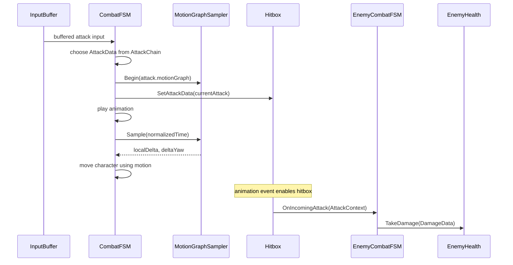
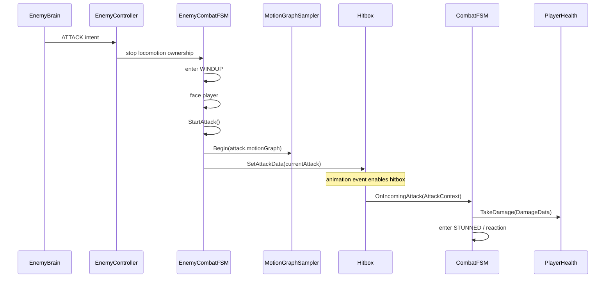

# Combat Design

## Overview
Combat is built around action-state execution plus motion-driven displacement. The runtime loop is:

`Input -> Combat FSM -> AttackData / MotionGraph -> Animation Events -> Hitbox -> AttackContext -> Damage / Hit Reaction`

The same pattern is used for:
- attacks
- dodges
- hit reactions

## Core Runtime Types

### `CombatFSM`
Player combat execution owner.

Responsibilities:
- consume buffered input
- choose attacks from attack chains
- drive attack, dodge, parry, and stunned states
- assign attack data to the player weapon hitbox
- apply motion sampled from `MotionGraphSampler`
- receive incoming attacks and convert them into player reactions

### `EnemyCombatFSM`
Enemy combat execution owner.

Responsibilities:
- own attack windup
- rotate toward player before attacking
- execute attack motion from `AttackData`
- receive incoming attacks and enter hit reaction states
- expose `BlocksLocomotion` so AI orchestration knows when combat owns movement

### `MotionGraph`
Defines cumulative movement and optional yaw over normalized time.

Used by:
- attacks
- dodges
- hit reactions

### `MotionGraphSampler`
Converts cumulative authored curves into per-frame deltas.

Important behavior:
- `Begin` resets sampling time
- `Sample` clamps normalized time
- returned `localDelta` is frame delta, not total displacement

### `AttackData`
Defines one attack:
- clip
- damage
- motion graph
- combo window

### `AttackChain`
Defines a sequence of `AttackData` assets and combo progression rules.

### `DamageData`
Defines the resolved damage payload sent to a health component:
- damage
- stagger
- poise damage
- attack properties
- hit location / normal
- attacker reference

### `AttackContext`
Defines the pre-resolution hit payload passed from hitbox to combat receiver:
- attacker
- target
- attack asset
- attack direction
- origin
- hurtbox type hit

### `Hitbox`
Active attack collider.

Responsibilities:
- stay inactive outside active frames
- detect hurtbox collisions
- dedupe targets per activation window
- emit `AttackContext`

### `Hurtbox`
Passive target collider tag with body-region metadata.

## Player Combat Flow

## Enemy Combat Flow

## Motion-Driven Attacks
- Attack displacement is not hardcoded per clip in code.
- The FSM samples a motion graph every frame and converts local-space deltas into world-space movement.
- Yaw is optionally applied from the same graph.

Why it exists:
- decouples attack feel from animator root motion
- allows attack tuning without code edits
- keeps combat motion consistent across player and enemy

## Motion-Driven Dodges
- Dodge uses `DodgeData.dodgeGraph`.
- The player computes a dodge basis from current movement direction.
- Sampled deltas are projected along that basis.

Why it exists:
- supports directional dodge behavior
- keeps dodge movement tunable without clip-specific code

## Motion-Driven Hit Reactions
- Incoming attacks are mapped to a `HitReactionData`
- The selected reaction provides both clip and motion graph
- Stunned state samples that graph to produce hit displacement

Why it exists:
- allows hit reactions to have authored pushback
- separates directional reaction choice from movement logic

## Hit Reaction Selection
Player and enemy both use `HurtboxReactionMap[]` to choose a reaction by:
- body region hit
- attack direction relative to target

This gives:
- directional reactions
- region-aware reactions
- data-driven extensibility

## Combat State Responsibilities

### Player
- `IDLE`: can consume attack input
- `ATTACKING`: owns attack motion and combo logic
- `PARRYING`: owns parry timing window
- `DODGING`: owns dodge motion
- `STUNNED`: owns hit reaction motion

### Enemy
- `IDLE`: waits for AI intent and cooldown
- `WINDUP`: rotates toward player before attack commitment
- `ATTACKING`: owns attack motion
- `STUNNED`: owns hit reaction motion

## Design Decisions

### Why hitboxes emit `AttackContext` instead of `DamageData`
- lets defender decide final outcome
- enables parry/dodge/block rules
- keeps hit detection separate from damage resolution

### Why combat systems own hit reactions
- hit reactions are stateful and animation-bound
- health should not choose reaction animations

### Why motion graphs are cumulative
- easier for designers to reason about total displacement shape
- sampler can derive smooth frame deltas

## Current Implementation Status

Implemented:
- buffered player attack input
- player combo progression
- enemy windup and attack execution
- motion-driven attacks, dodges, and hit reactions
- hitbox / hurtbox collision pipeline
- player and enemy health components

Partially implemented / in progress:
- dodge/parry damage rules
- perfect parry / perfect dodge
- anti-repeat-hit lifecycle hardening
- consistent defensive validation before applying damage

Known weak points:
- some state paths still rely on animation events
- some duration math assumes nonzero clip lengths
- `Hitbox` currently contains a temporary comment indicating lifecycle cleanup is still being tuned
