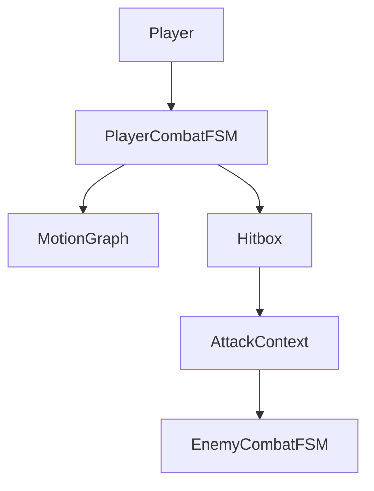
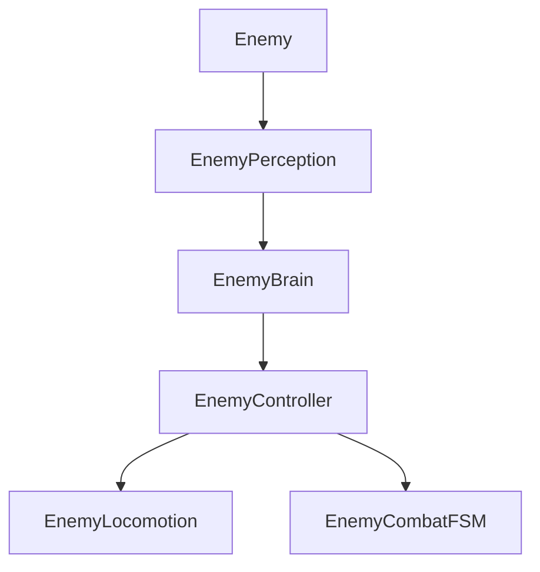

# CombatSystem

A third-person melee combat prototype inspired by the timing, movement commitment, and reactive swordplay of Ghost of Tsushima.

## Overview

CombatSystem is a Unity gameplay programming project focused on building a responsive 1v1 melee combat foundation. The current prototype explores data-driven attacks, motion-authored combat movement, directional dodging, enemy perception, and modular enemy AI.

The project is in active prototype development. Core combat and AI systems are implemented, while defensive validation, combat polish, and advanced enemy behavior are still being expanded.

## Features

### Combat

- MotionGraph-driven movement for attacks, dodges, and hit reactions
- Light and heavy combo attack chains
- Direction-based dodging from camera-relative movement input
- Parry state and timing data foundation
- Motion-driven attacks using curve-authored displacement
- Motion-driven dodges with configurable i-frame windows
- Directional hit reactions based on attack direction
- Directional stagger/reaction selection through hurtbox reaction maps

### Enemy AI

- Enemy perception with view distance, raycast visibility, and attack range checks
- Enemy brain that converts perception into `IDLE`, `CHASE`, or `ENGAGE` intent
- Enemy controller that routes AI intent into locomotion or combat ownership
- Combat director that maintains a focus enemy, assigns circling slots, and gates attack pressure
- Enemy combat FSM with windup, attack, and stunned states
- Hybrid `NavMeshAgent` pathfinding with `CharacterController` movement execution

### Gameplay Systems

- ScriptableObject-driven attacks
- Data-driven combat tuning through `AttackData`, `AttackChain`, `DodgeData`, `ParryData`, and `HitReactionData`
- Hitbox/Hurtbox collision pipeline
- Defender-owned damage and reaction resolution
- Reusable MotionGraph sampling system
- Input buffering for combat actions

## Architecture

The player stack separates locomotion, buffered input, combat state, and health. `CombatFSM` owns action commitment and asks `MotionGraphSampler` to apply frame-by-frame displacement during attacks, dodges, and hit reactions.

The enemy stack separates sensing, decision-making, orchestration, movement, and combat execution. `EnemyController` is the handoff point between AI intent and the systems that physically move or attack.

## Technologies

- Unity 6000.3.0f1
- C#
- CharacterController
- NavMeshAgent / AI Navigation
- ScriptableObjects
- Animator and animation events
- Unity Input System
- Universal Render Pipeline
- Git

## Folder Structure

| Path | Purpose |
| --- | --- |
| `Assets/_Project/Scripts/Player` | Player locomotion, input buffering, combat FSM, health |
| `Assets/_Project/Scripts/Enemy` | Enemy AI, locomotion, combat FSM, health |
| `Assets/_Project/Scripts/Scriptables` | Combat data assets and motion definitions |
| `Assets/_Project/Scripts/Shared` | Hitbox, hurtbox, enums, shared helpers |
| `Assets/_Project/Scripts/Structs` | Combat payloads such as `AttackContext` and `DamageData` |
| `Assets/_Project/Scripts/Interfaces` | Damage and attack receiver contracts |
| `Assets/_Project/Scripts/Terrain` | Terrain and grass utility tooling |
| `Docs` | Internal architecture, roadmap, and design notes |

## Current Progress

Implemented:

- Player movement, combat input buffering, combo attacks, dodging, parry state, and hit reactions
- MotionGraph displacement for attacks, dodges, and stun reactions
- Enemy perception, brain, controller, locomotion, attack windup, attacks, and stun reactions
- Hitbox/Hurtbox combat context pipeline
- Basic player and enemy health components
- Terrain and grass utility tooling

Planned:

- Stable one-hit-per-swing lifecycle validation
- Full dodge and parry damage validation
- Perfect parry and perfect dodge rules
- Block/guard, poise, stagger, and death reactions
- Enemy attack variety, group AI, and multi-enemy polish

## Installation

1. Clone the repository.
2. Open the project in Unity 6000.3.0f1 or newer.
3. Let Unity restore packages from `Packages/manifest.json`.
4. Open the prototype scene under `Assets/_Project/Scenes/Proto1`.
5. Press Play to test the current combat prototype.

## Screenshots

> GIF and screenshot placeholders:

- `docs/media/combat-demo.gif`
- `docs/media/motiongraph-debug.png`
- `docs/media/enemy-ai-demo.gif`

## Future Plans

- Harden defensive combat rules and hit validation
- Add richer enemy attack selection and multi-enemy polish
- Improve animation polish and combat feedback
- Expand debug visualization for MotionGraphs, hitboxes, and AI state
- Add more robust death, stagger, and poise handling

## License

MIT License placeholder. Replace this section with the final project license before public release.
