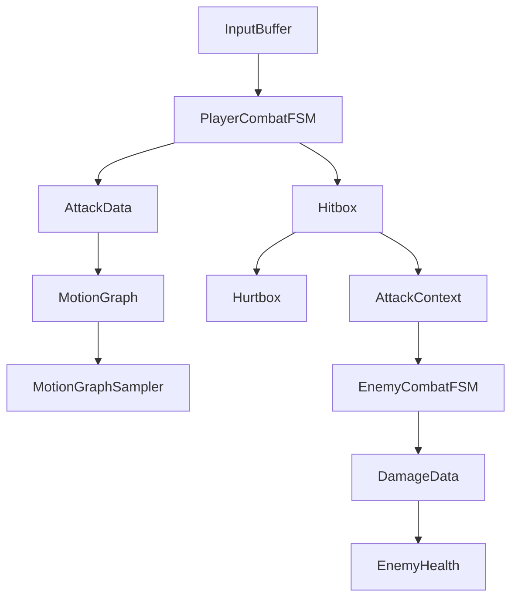
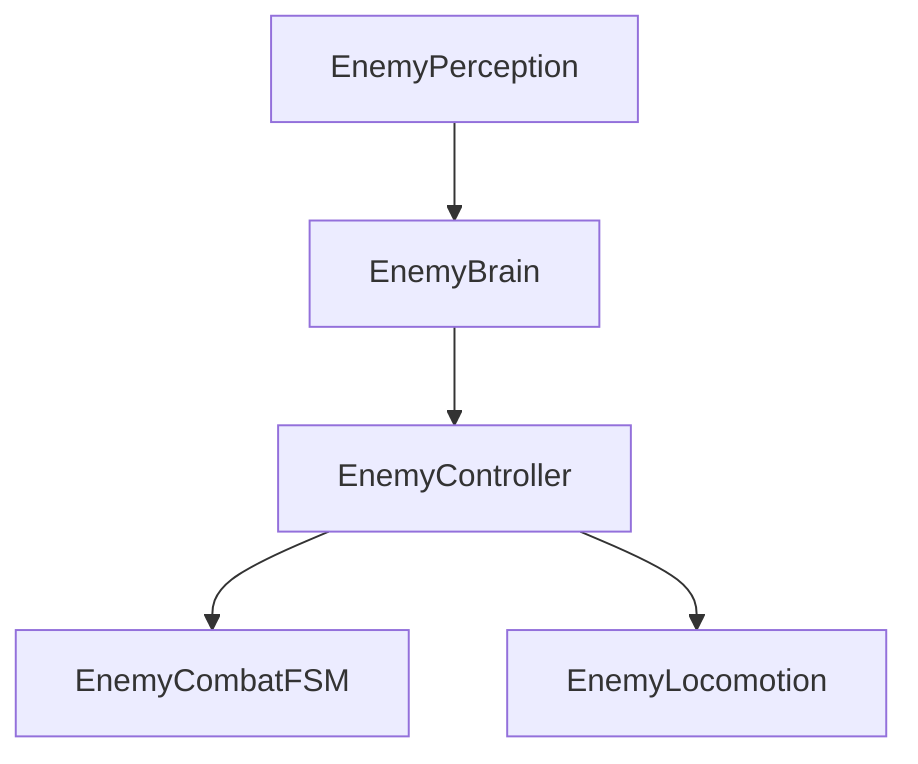
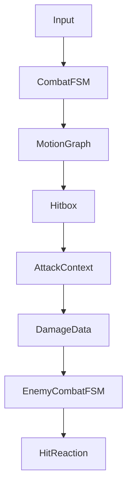

# CombatSystem - Gameplay Programming Portfolio

## Project Summary

CombatSystem is a third-person melee combat prototype built in Unity and C#. The project focuses on Ghost of Tsushima-inspired 1v1 sword combat, with an emphasis on animation-aware state machines, data-driven attack tuning, motion-authored displacement, and modular enemy AI.

My goal was to learn how to structure combat gameplay systems that are responsive, debuggable, and extensible. Rather than hardcoding every attack, dodge, and reaction, I built a set of reusable runtime systems driven by ScriptableObject data.

## Technical Highlights

### MotionGraph Movement System

`MotionGraph` stores cumulative local displacement curves for forward, right, up, and yaw motion. `MotionGraphSampler` converts those cumulative curves into per-frame deltas by comparing the previous sampled time to the current normalized time.

This was built to avoid relying entirely on root motion while still giving attacks, dodges, and hit reactions authored movement. The result is a reusable movement layer that can be tuned per asset and applied through `CharacterController.Move`.

### Data-Driven Combat Architecture

Attacks are represented by `AttackData` assets, chained through `AttackChain` assets, and executed by combat FSMs. Defensive behavior uses `DodgeData`, `ParryData`, `HitReactionData`, and `HurtboxReactionMap`.

This keeps tuning data out of gameplay code. Runtime systems own decisions and state transitions; assets own timing, clips, displacement, and reaction mappings.

### Modular Enemy AI

Enemy logic is split into:

- `EnemyPerception`: senses player visibility, distance, and attack range.
- `EnemyBrain`: converts perception into coarse intent.
- `EnemyController`: routes intent to locomotion or combat.
- `EnemyLocomotion`: handles pathing and movement.
- `EnemyCombatFSM`: owns windup, attack execution, and hit reactions.

The reason for this split is to separate decision-making from execution. That makes it easier to replace the simple intent logic later with utility AI or group behavior without rewriting movement and combat systems.

### Hybrid NavMeshAgent + CharacterController Movement

`EnemyLocomotion` uses `NavMeshAgent` for pathfinding but disables automatic position and rotation updates. The `CharacterController` performs physical movement using the agent's desired velocity.

This gives the enemy navigation data from Unity's NavMesh system while preserving direct control over movement, gravity, rotation, and combat interruptions.

### Hitbox/Hurtbox Architecture

`Hitbox` does not directly apply damage. It detects a valid `Hurtbox`, builds an `AttackContext`, and sends it to an `IAttackReciever`. The defender then decides how to resolve the incoming attack.

This supports richer combat rules because dodge, parry, block, hit reaction, damage, and future poise logic belong to the defender's current state.

## Software Architecture

### PlayerCombatFSM

Owns player combat state: idle, attacking, parrying, dodging, and stunned. It consumes buffered input, selects attacks from `AttackChain`, applies MotionGraph deltas, controls hitbox attack data, locks locomotion during committed actions, and resolves incoming attacks.

### EnemyCombatFSM

Owns enemy combat execution. It starts attacks only when the enemy brain requests attack intent, rotates toward the player during windup, samples attack MotionGraphs during execution, blocks locomotion while committed, and handles stunned reactions.

### EnemyBrain

Owns AI intent evaluation. It reads perception state and reduces it to `IDLE`, `CHASE`, or `ENGAGE` at a configurable interval. It does not move or attack directly.

### EnemyController

Acts as the orchestration layer. It checks whether combat currently blocks locomotion, stops movement during combat actions, and delegates chase behavior to `EnemyLocomotion`.

### EnemyPerception

Measures distance to the player, checks attack range, and uses raycasts against a view mask to determine whether the enemy can see the player.

### EnemyLocomotion

Uses `NavMeshAgent.SetDestination` for pathfinding and `CharacterController.Move` for actual movement. It also handles rotation toward desired velocity.

### MotionGraph and MotionGraphSampler

`MotionGraph` is authored as data. `MotionGraphSampler` is the runtime interpreter. The sampler is intentionally small and stateful: it stores the previous normalized time so the combat system can apply only the delta required for the current frame.

### AttackData, DamageData, and AttackContext

`AttackData` defines attack clip, motion graph, damage, and combo window. `AttackContext` is the hit event payload passed from attacker to defender. `DamageData` is created by the defender after it decides the attack should deal damage.

### Hitbox and Hurtbox

`Hitbox` is an attack volume enabled by animation events. It deduplicates targets per active window with a `HashSet`. `Hurtbox` identifies the receiver owner and body region, allowing reaction selection based on hit location.

### ScriptableObjects

ScriptableObjects are used for combat authoring: attacks, chains, motion graphs, dodge settings, parry timing, and hit reactions. This makes tuning visible in the editor and keeps gameplay code focused on state and orchestration.

## Major Technical Challenges

### MotionGraph Movement Without Root Motion

Problem: attacks and dodges needed authored displacement, but tying gameplay entirely to root motion would make tuning and interruption logic harder.

Investigation: I compared hardcoded movement, animation root motion, and curve-authored displacement. Hardcoded values were too rigid, while root motion made combat ownership less explicit.

Final solution: MotionGraphs store cumulative curves, and `MotionGraphSampler` converts them into per-frame deltas. Combat states decide when to sample and how to transform local deltas into world movement.

Lesson learned: animation-like movement can be data-driven without surrendering gameplay control.

### Combo Displacement Accumulation

Problem: chained attacks needed consistent forward displacement when transitioning between combo clips.

Investigation: sampling each clip independently exposed edge cases where previous displacement could be lost during combo continuation.

Final solution: the player combo path applies final displacement from the previous attack's MotionGraph once before starting the next attack.

Lesson learned: cumulative motion systems need clear reset and transition rules.

### Hybrid NavMeshAgent + CharacterController

Problem: enemies needed navigation, but combat states also needed precise ownership over movement and rotation.

Investigation: allowing the NavMeshAgent to update transforms directly would conflict with attack windup, hit reactions, and movement locks.

Final solution: the NavMeshAgent calculates desired velocity while the CharacterController performs movement. Combat can stop locomotion by resetting the path or blocking movement.

Lesson learned: pathfinding and movement execution are separate responsibilities.

### Enemy AI Architecture

Problem: placing sensing, decisions, movement, and combat in one script would make the enemy hard to extend.

Investigation: I separated the enemy into perception, brain, controller, locomotion, and combat layers.

Final solution: intent flows down from perception to brain to controller, while execution remains owned by locomotion and combat components.

Lesson learned: layered AI makes future behavior upgrades much cheaper.

### Hit Reaction Pipeline

Problem: hits needed directional reactions and movement, not just health subtraction.

Investigation: hit reaction data needed to depend on both hurtbox type and attack direction.

Final solution: incoming attacks calculate relative direction, look up a `HitReactionData` through `HurtboxReactionMap`, play the reaction clip, and sample a reaction MotionGraph during stun.

Lesson learned: reactions are part of combat state, not a side effect of damage.

### Direction-Based Dodge Implementation

Problem: dodges needed to follow player intent relative to the camera while still playing directional animation.

Investigation: raw input alone was not enough; the system needed both world direction for movement and local direction for animation parameters.

Final solution: `PlayerLocomotionController.GetDodgeDirection` returns both world and local dodge vectors. `CombatFSM` uses the world basis to apply dodge MotionGraph movement and local values to drive animator parameters.

Lesson learned: animation and physics often need different representations of the same input.

## Design Philosophy

- Composition over inheritance through small MonoBehaviour components.
- Data-driven architecture for attacks, motion, dodges, parries, and reactions.
- Layered AI with sensing, intent, orchestration, and execution separated.
- Separation of decision and execution in both combat and AI.
- Defender-owned damage resolution through `IAttackReciever`.
- Reusable MotionGraph system shared by attacks, dodges, and reactions.
- Interface-driven damage contracts through `IDamageable`.

## AI Architecture

`EnemyPerception` answers what the enemy can sense. `EnemyBrain` answers what the enemy wants to do. `EnemyController` decides which execution system should act. `EnemyCombatFSM` executes committed attacks and reactions. `EnemyLocomotion` executes chase movement.

This structure keeps combat from becoming AI decision code and keeps pathfinding from needing to understand attack timing.

## Combat Pipeline

1. Input is recorded in `InputBuffer`.
2. `CombatFSM` consumes input when the current state allows it.
3. The selected attack provides animation, timing, damage, and motion data.
4. `MotionGraphSampler` applies frame deltas during the attack.
5. Animation events enable the active weapon `Hitbox`.
6. `Hitbox` creates `AttackContext` and sends it to the defender.
7. The defender creates `DamageData`, applies health changes, selects a reaction, and enters a stunned state.

## Performance Considerations

- Components cache references in `Awake` instead of repeatedly querying during state execution.
- AI intent evaluation is interval-based rather than recalculated every frame at full cost.
- ScriptableObjects store shared tuning data instead of duplicating configuration per instance.
- `Hitbox` uses a `HashSet` to avoid repeated target hits within an active window.
- Movement sampling uses lightweight curve evaluation and value structs.
- Update responsibilities are split so perception, brain, controller, combat, and locomotion each do limited work.

## What I Learned

This project strengthened my understanding of gameplay state machines, action commitment, animation-aware movement, and AI system boundaries. I learned how important it is to keep combat decisions explicit, to make data editable without rewriting code, and to build debugging-friendly pipelines where ownership is clear.

The biggest engineering lesson was that polished combat is less about one large system and more about many small systems agreeing on timing, ownership, and data flow.

## Future Improvements

- Finish dodge i-frame and parry validation before damage resolution.
- Add perfect parry and perfect dodge outcomes.
- Stabilize one-hit-per-swing lifecycle across all animation events.
- Polish focus handoff, slot fairness, attack variety, utility AI, and group coordination.
- Add boss AI and stance-specific combat responses.
- Improve death handling, poise, stagger, and interruption rules.
- Add debug visualization for MotionGraphs, hurtboxes, active frames, and AI state.
- Explore networking considerations for authoritative combat timing.

## Skills Demonstrated

- Gameplay programming
- Combat system architecture
- AI programming
- Animation-aware state machines
- Unity CharacterController movement
- NavMeshAgent integration
- ScriptableObject-driven design
- Hitbox/Hurtbox collision systems
- Directional hit reactions
- Input buffering
- C# software architecture
- Debugging and technical documentation
